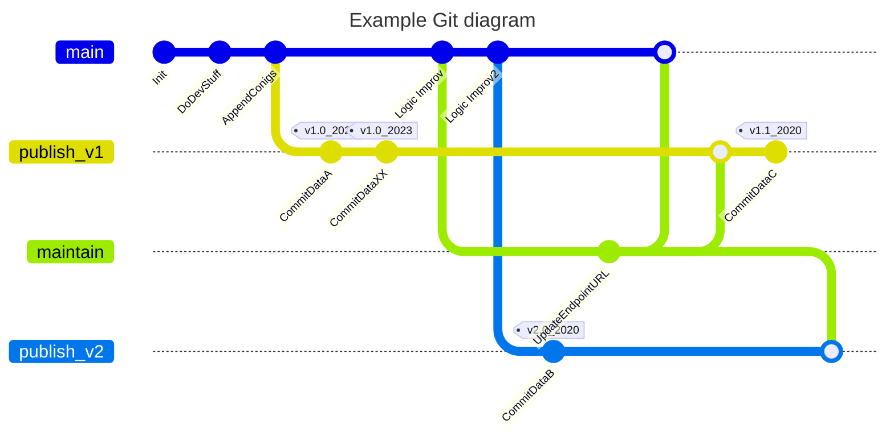

# CRBA Project

Introduction ...

This Repository is the desendent of this repository: https://github.com/UNICEFECAR/data-etl/tree/CRBA_ETL_DOCKERED

# All-in-on CRBA Project

The approach for this repository is to have all the code, data, and documentation in one place to allow future readers to follow the project well.
An ETL framework was not used to allow comprehensibility for a larger group. 
The data which is generated is also stored in the repository to get the connection between code, data and executor. ANd also for future usere to have a simple access. 
Also the output data should rarely change. Under further condiderations some extendet thoughts can be found. 

## ETL Scheme
A simplified scheme for the etl is depicted below.

In generall the CRBA report is constructed from a number of indicators. Each indicator represents the childs right situation in a country in a specific field (e.g education). Indicators are kind of a concept. Sources can be seen as implementation. It is possible to obtain similar information from diffrent sources 

The sources to indicator relation is 1-n. Means one Source ca be used to compute n diffrent indicators. 
Via the configuration file it is defined which source is used for wich indicator.

# Evolution over Time 
The crba report can be computed/build for diffrent target_years. 
To use this repository for a longer period the following concept is used.

The repository can be considered to have two sections. This section can be named dynamic and static section. The first section, called static, hold code and data which is fixed over multipe target years (e.g. etl code, indicator definitions). But can evolv over time (see [Git Branching Strategy](#git-branching-strategy)). The code in this sections leaves a certain degree of freedome to be filled. This is for specific target year configurations (e.g. date_form; date_to). 
The second section, called dynamic, is needed to fill this degree of freedom. 
All folders and files execpt for the config directory belogs to the first section.

In the following is explained which degree of freedom is implemeted a this version. But this is **NOT** set in stone an can be shifted if needed. A rule of thum is to but as much as possible in the firt section and leave as much as needed in the config section.In this way, the results can be better compared from year to year. 

In the etl section it is hard wired:
- how to combine the diffrent indicators 
- transformations for diffrent sources 
- how to map sources to indicators  

For the config section remains to define: 
- which source to use and configurations e.g. date_form; date_to
- target_year
- scripts for manual data transformation
- data which is manual pulled

**For future develoments it can be reconsidered how big the degree of freedom should be**

## Git Branching Strategy
This git branching strategy is custom designed and open for changes. 
The main branch holding to project structure as decribed above. 
If one verion is ready to get used to produce publishable data a new branch called *publish_v<number>* is created. In this new branch the code gets locally executed and the produced data can be checked in(commited). Thus the main branch stays free of produced data but nevertheless a linkage between code, auther  and data is created. To better retrieve the data later in the repo, a tag can be assigned to a data publish commit. Tags should have the structure as follows: *v<coder_version>_<target_year>
Over time the main branch evolve. There are till now two types of changes. One is called *maintain* and the other called *logic*. 
Maintain changes are used to refactore the repo or to update outdated URL Endpoints. 
For this changes a branch is cretead and merged into all other branch which needs is. 
The *logic* commit is meant for the main branch soley. After some logic changes a new publish_v2 is branched. 

# Directory Structure 

## ELT
The main directory is the etl directory. Here is the python code for downloding and transforming the data. 
## Configs
Under configs lies the diffrent configurations for the target_years. For the different sources for example the considerted periods are diffrent. 
## Tests
Under the folder test reside **functional** tests. Means test that checks the etl code with mock data. 
## Validations
Under the "Validations" folder there is code for checking the validity or correctness of the content of the data.
Here the framework Greate Expactations is used.  
## Docs
Under "Docs" there are manual and generated documentaion about the etl. 
## Scripts
The scripts directory is to store some helper scripts for local development and dcumentation generation. 
It is not relevant to to CRBA Report istself 

# Toolchain
To reproduce the results and code the following tools are used. 
* greate-expectations
    - to handle test case for the data
* pynev
    - to manage python versions
* poetry 
    - to manage python dependencies
* git 
    - for versioning the project 

