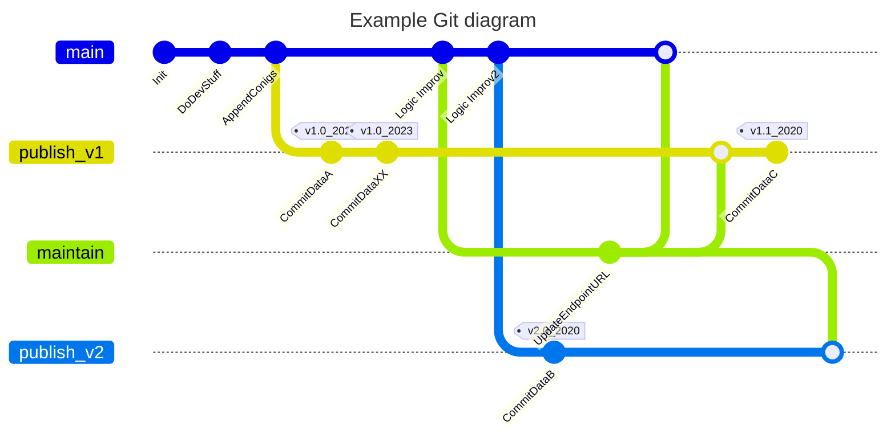

# Children's Rights Business Atlas (CRBA)

The Children's Rights Business Atlas (CRBA) is an index to measure, assess and prioritise impacts on children’s rights in 195 countries. It helps businesses and industries assess potential and actual impacts on the lives of children and guides the integration of children’s rights into due diligence practices and procedures.

The CRBA is created with a Python-based extract-transform-load (ETL) pipeline, which takes data from a wide range of sources (around 200). For example, various APIs (e.g. SDG API), publicly accessible datasets in .xlsx format (e.g. World Policy Analysis data) and reports. The ETL pipeline then transforms the data from these sources and creates a single .csv file called `crba_final.csv`. 

This repository contains all components to create that CRBA dataset.

## Further information and documentation

Please note refer to these links: 

| What| Link |
| -------- | -------- |
| Documentation of general CRBA methodology and non-code documentation   | https://docs.google.com/document/d/1bjvQ2lt4VvxoXjunDU7X9NVF1cVHRG6b/edit   |
| UNICEF Indicator Data Warehouse, where final CRBA dataset can be downloaded    | https://sdmx.data.unicef.org/data/overview.html  |

## History, timeline and changelog of CRBA

| When| What | Changelog |
| -------- | -------- | -------- |
| 2018  | Version 1 of CRBA published. Dataset was created with various Excel sheets. Source data was manually extracted and processed   | N/A
| 2020    | Version 2 of CRBA is published | <br>- Discard manual and excel based extractions and processing of data </br>- Change various data sources, add and exchange several indicators </br> - Switch to Python-based repo </br>- Updates to methdology (e.g. the way how aggregate scores are computed)  </br>-  See here for code base which created the CRBA data of 2020: https://github.com/UNICEFECAR/data-etl/tree/CRBA_ETL_DOCKERED |
| 2023    | Version 3 of CRBA is published | <br>- major refactoring and improvement of repo and code structure  <br>- refactoring of code (e.g. code is much DRYer now, with extractor subclasses) <br>- Code is more robust and idempotent (one command) <br>- Major improvement of logs (error log file of failed resources is created as separate log file) <br>- More logical separation of input and output <br>- More logical separation of artifacts (e.g. config vs code) <br>- More logical branching structure (main vs publish branch), which allows for better reproducability, versioning and publishing <br>- Improved and updated documentation <br>- Automated tests/ validations (Great Expectations) <br>- Various minor changes to methdology and certain indcators: See here for the full list of changelogs in terms of methdology: https://docs.google.com/document/d/1bjvQ2lt4VvxoXjunDU7X9NVF1cVHRG6b/edit     |

## Overview and structure repo

The approach for this repository is to consolidate all the code, data, and code documentation in one place to facilitate future readers and contributors in understanding the project. An ETL framework was intentionally not used to ensure comprehensibility for a larger group of individuals. The generated data is stored within the repository itself, establishing a clear connection between the code, data, and its executor. This approach also ensures easy access for future users. It is worth noting that the output data is not expected to change frequently, and there are extended considerations on this matter.

This is an overview of the components and subfolders of the repo: 

| What| Link |
| -------- | -------- |
| `/etl`   | The main directory is the ETL directory. It contains the Python code for downloading and transforming the data.   |
| `/config`    | Under the configs directory, you'll find different configurations for target years and sources. This folder also contains both the input and ouput data (if you are on a publish branch)  |
| `/tests`   | The tests folder contains functional tests that check the ETL code using mock data.  |
| `/validations`   | The validations folder includes code for checking the validity or correctness of the data, including the use of "Great Expectations"  |
| `/docs`   | Under the docs directory, you can find both manual and generated documentation, including a data dictionary.   |
| `/scripts`   | The main directory is the ETL directory. It contains the Python code for downloading and transforming the data.   |

## Overview ETL Schema

This is a simplified overview of the ETL process:


In general, the CRBA report consists of around 200 indicators, where each indicator represents the situation of children's rights in a specific field (e.g., one indicator is `Birth registration under 5 years of age`) within a country. Indicators are computed, by extracting and transforming data from a source (e.g. the SDG data warehouse API, or reports from NGOs). Therefore, indicators serve as a conceptual representation, while sources act as their implementation. It is possible to obtain similar information from different sources.The relationship between sources and indicators is one-to-many, meaning one source can be used to compute multiple indicators. The configuration file defines which source is utilized for each indicator.


## Evolution over Time 
The CRBA report can be computed or built for different target years. To ensure the longevity of this repository, the following concept is employed.

The repository can be divided into two sections: a dynamic section and a static section. 

**Static section**: The static section contains code and data that remain fixed across multiple target years (e.g., ETL code, indicator definitions), yet can evolve over time (see [Git Branching Strategy](#git-branching-strategy)). The code in this section allows for a certain degree of freedom to accommodate specific configurations for target years (e.g., date range). All folders except for the `/config` folders belong to that static section.

**Dynamic section**: The dynamic section consists of the `/config` folder. The config folder fills the degree of freedom

The following explains the current implementation of the degree of freedom. However, this is _not_ set in stone and can be adjusted if necessary. The general rule is to include as much as possible in the static section while leaving what is needed in the config section. This approach enables better year-to-year comparison of results.

Within the ETL section, the following aspects are hardcoded:

- Configuration of different indicators
- Transformations for different sources
- Mapping of sources to indicators

The config section is responsible for defining:

- Which source to use and its configurations (e.g., date range)
- Target year
- Scripts for manual data transformation
- Manually pulled data

It is essential to re-evaluate the level of flexibility required for future developments.

## GIT branching Strategy

The Git branching strategy employed here is custom-designed and subject to changes. 

The overall idea is to have the `main` branch as well as several `publish` branches. 

### main branch

The `main` branch adheres to the project structure described above. 

### Creating a publish branch

When a version is ready for generating publishable data (i.e. when you want to run the ETL pipeline to create a new version of the CRBA dataset), create new branch named `publish_v<number>`. 

In this new branch, execute the code locally. This will produce the dataset in `config/<year>/out/*` and the produced data can be committed. This approach ensures that the main branch remains free of produced data, while still establishing a link between the code, author, and data. To facilitate data retrieval later in the repository, tags can be assigned to data publish commits. Tags should follow the structure: v<coder_version>_<target_year>. 

### Future development with the branching strategy

Over time, the main branch evolves, undergoing two types of changes: maintain and logic. _Maintain_ changes are used for refactoring the repository or updating outdated URL endpoints. A branch is created for these changes and subsequently merged into any other branch that requires it. Logic commits are exclusively meant for the main branch. After implementing certain logic changes, a new `publish_v2` branch can be branched off. 

Lasse, could you please clarify this a little more? I don't quite understand this part yet. 



## Toolchain
To reproduce the results and code the following tools are used. 
* greate-expectations
    - to handle test case for the data
* pyenv
    - to manage python versions
* poetry 
    - to manage python dependencies
* git 
    - for versioning the project 

## How to use the repo to (re)produce a CRBA file 

If you wish to make changes to the repo, or simply use it to (re)produce your own version of the CRBA data, please follow these steps: 

| Step| What do to |
| -------- | -------- |
|  1 | Clone the repository   |
|  2 | To setup the repo run `poetry install` <br> Important: The repo is using seleniums drive for Chrome. So to run the repo, you must have chrome installed (or use a different selenium driver)   |
|  4 | To publish your results. Create one branch for code cahnges and one branch to publish data results   |
|  5 | To run the code run `python etl --config-path config/2023 --extract-stage --combine-stage --sdmx-stage`. |

You will then see the pipeline execute. It will create the following output: 

| Where| What  |
| -------- | -------- |
|  `config/<year>/out/data/` | This is where the `crba_final.csv` will be stored  |
|  `config/<year>/out/data/indicator` | This is where all of the extracted and transformed indicators are stored   |
|  `config/<year>/out/data/error` | data/error contains the dataframe as csv to th point where the execution of the source adapter failed. |
|  `config/<year>/out/validation` | This is where the output of the automated validations produced by `Great Expectations` is stored  |
|  `config/<year>/out/` | This is where you will find `error.log` and `log.log`. These files contain the logs of your ETL run, and specifially information on which sources/ indicators could not be processed along with their error message. You will also find `crba_report_definitions.json`, which is a summary of the metadata of each indicator.  |

### Using the filter to only run the pipeline for certain indicators

If you want to run the pipeline for only certain indicators, you can set filters. Do this by passing the flag `--build-indicator-filter <filter.sql|filter.csv>`. One can give a sql file with a where condition. E.g. 
```sql
SOURCE_BODY=="World Policy Analysis Center"
```
Or a csv file where the first column are Source Id's. 
This filters are applied to the crba_report_definition set. 


## How to further develop the repo (e.g. to include or modify sources/ indicators/ ...)

You may want to further develop the CRBA codebase, or you may have to update certain parameters. For instance, it might be that a data source, which is manually extracted and checked into the repo has a new data that you will want to check into the repo. Or it may be, that the URL of APIs or other sources has changed, or that the description of a data source has changed. 

In all of these cases, follow these steps, firstly follow the steps outlined above to get the repo up and running on your computer. Then follow these steps: 

### I want to delete an indicator

You dont have to delete an indicator on a global bases. If one indicator should not be used for a report just remove the corresponding source from the source selection. 

### I want to update metadata of a source (e.g. update the API URL or the title of the source)

Please note that the information about sources lives in two places. Depending on what kind of change you want to make, you must modify the information in different places: 

- `resources/source_definitions.json` (for global changes): This is the bulk and majority of information about a source (including how it is extracted, what the source type and address is etc.) lives. This source definition file acts as first line of truth and applies globally, unless overwritten
- `config/<year>/in/source_selection.json` (for changes for a given year/ run): This can be used to overwrite certain information from `resources/source_definitions.json`. This is necessary, when for on run in, say 2020, the information of the source is different than in say, 2023. For example, the source title may changed slightly, or the way to retrieve the info may have changed as well. 

### I want to update the value types of an indacotr (e.g. my indicator now has 4 categorical values, instead of only 3)

Go to `resources/value_type` and make a new entry there. Then, make sure to insert the new value id `V-xx` at the specific source/ indicator in `config/<year>/in/source_selection.json` (assuming that your changes aren't supposed to be global but only for a cerain run/ year, s. questions above)

### I want to add a new indicator

Just write a new Inidator in the etl/resources/indicator.json file

## Got questions, feedback or want to report a bug? 

Please contact Michael Gramlich (info@michael-gramlich.com) 
